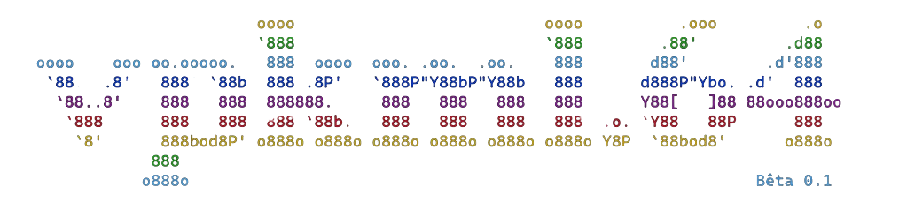
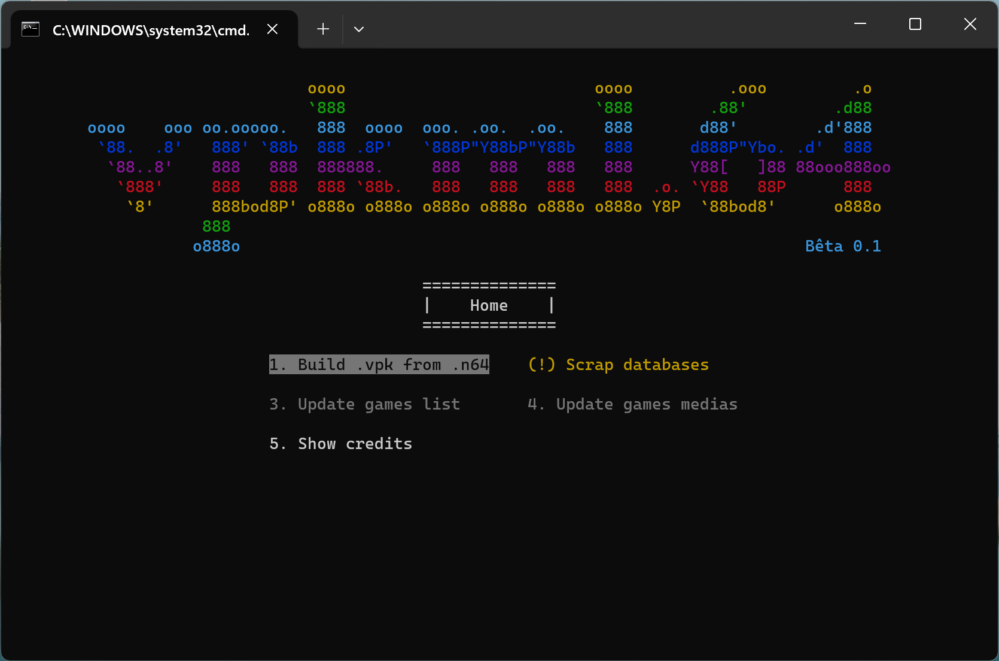
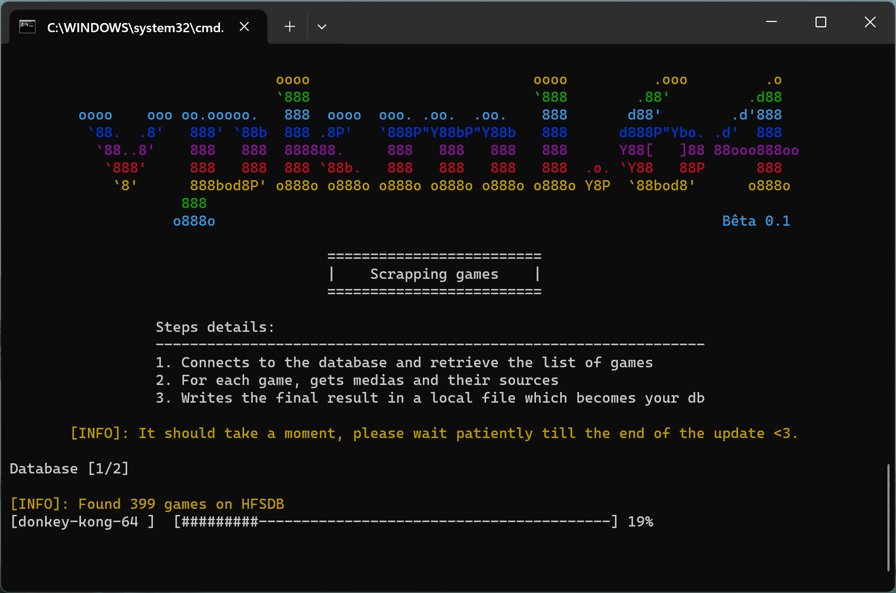
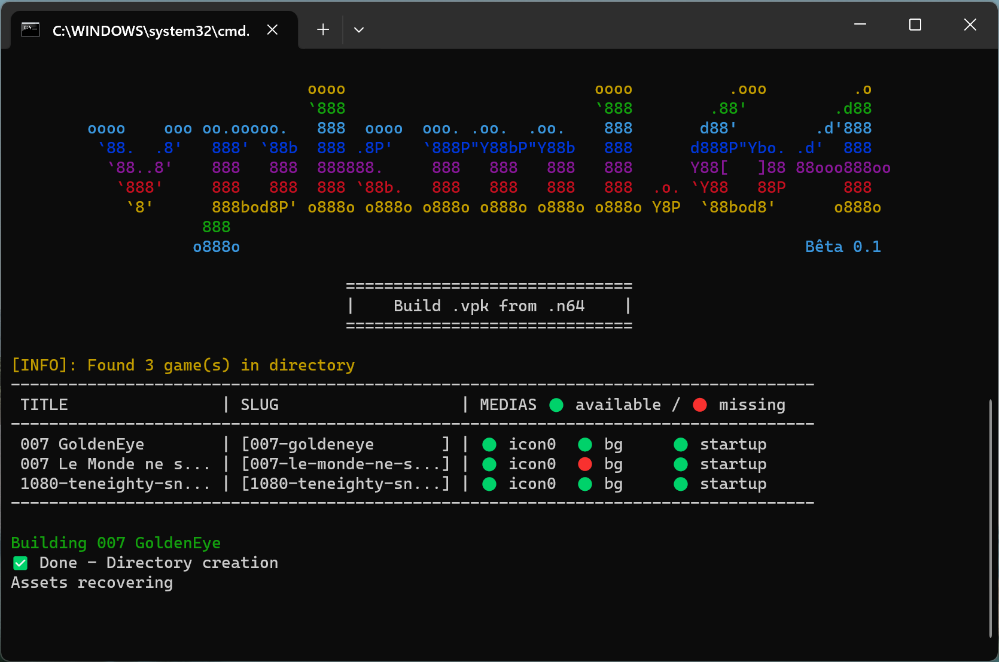

## Description
This software is aimed at users of DaedalusX64 on PsVita.

Are you tired of having to launch your emulator every time you want to dive back into a wild game of MarioKart 64? Or Zelda? Or any other game on your beloved Nintendo 64? Maybe Vpkml64 will take care of your concerns.

Quickly create shortcuts for each of your n64 games using a completely automated process. Vpkml64 takes care of retrieving the media needed to create an XMB application launcher and will build your .vpk file. Load your .n64 (or .z64) files into the application directory, start the build and all you have to do is install the files on your PsVita.

## Informations
In order to completely automate the creation of shortcuts, Vpkml64 retrieves media (images) from online ("open") databases. The final appearance of your shortcut might not suit you, which is completely understandable. This project aims to facilitate the construction of launchers, for lazy people. If you want to be able to fully customize your shortcuts, I invite you to read the following [tutorial](https://www.customprotocol.com/tuto-creer-bulles-custom-jeux-nintendo-64-pour-ps-vita/).

## A little history about this project
The software is mainly developed in OCaml. The choice of this technology is essentially based on my masochistic perversions. More seriously, this project is a continuation of a utility that I quickly developed a few years ago to help a friend. At this time in my life, I was primarily working in OCaml to meet the needs of a bigger project. However, the program that I had developed was not suitable for less experienced users. This new solution will allow any Windows user to create their own shortcuts without having to worry about anything (well, maybe installation). A shorter version of the history could be: _"I developed this program to pass the time, without really breaking my head"_.

## Installation
You have two ways of running this program on your computer:

### Easier way
Download `vpkml64.exe`, `libmg10.dll` and `vpkml64.bat` files. Run `vpkml64.bat` to run the program ;

### Badass way
1. Install Cygwin and [OCaml for Windows](https://fdopen.github.io/opam-repository-mingw/installation/), you'll need opam confiogured on a specific switch (`ocaml-variants.4.14.0+mingw64`) since the software is meant to be compiled and used on Windows
2. Run `opam install dune cohhtp cohttp-lwt-unix lwt lambdasoup re str yojson` ;
3. Clone the project, move in the root directory and run the `make build` command in your Cygwin console ;
4. Your executable version will be build and available from your root directory.

_*Info*: You may need to update your Cygwin binaries/packages through the installation process. For this, you'll have to reload the Cygwin setup executable and follow instructions_.

## Tutorial
1. Insert your  `.n64` files inside the project's `.\roms` directory ;
2. Run the `vpkml64.bat` file ;
3. The Windows prompt will open and shows the home menu of the program. To select an option, you can use arrow keys, `enter` to run and `escape` to quit ;

4. During the _first time use_, you'll have to update the database. It would certainly take a moment (_no API, only soup_) ;

5. Once you got your full database, other features should be available. You can start building your own vpks using the second option ;

Here, you got several information:
- First, the program says that it found 3 games inside the directory ;
- Then, it shows a list of these games and missing medias of each ;
- Finally, it builds `.vpk` files of complete games and will save them in `.\vpks`.

## Special thanks
- [@CraigFe](https://github.com/craigfe/progress/) - Who helped me to better understand C interfacing in OCaml through his projects, and from who I took the terminal width calculation method 
- [@vitasdk](https://github.com/vitasdk/vita-toolchain) - For providing the `vita-mksfoex` and `vita-pack-vpk` tools
- [@Rinnegatamante](https://github.com/Rinnegatamante/DaedalusX64-vitaGL) - For the DaedalusX64 port and, more generally, for his work
- [@ImageMagik](https://github.com/ImageMagick/ImageMagick) - For providing `convert` and `mogrify` tools
- [pngquant](https://pngquant.org/) - For the excellent tool for reducing the color palette of PNG images used in my project